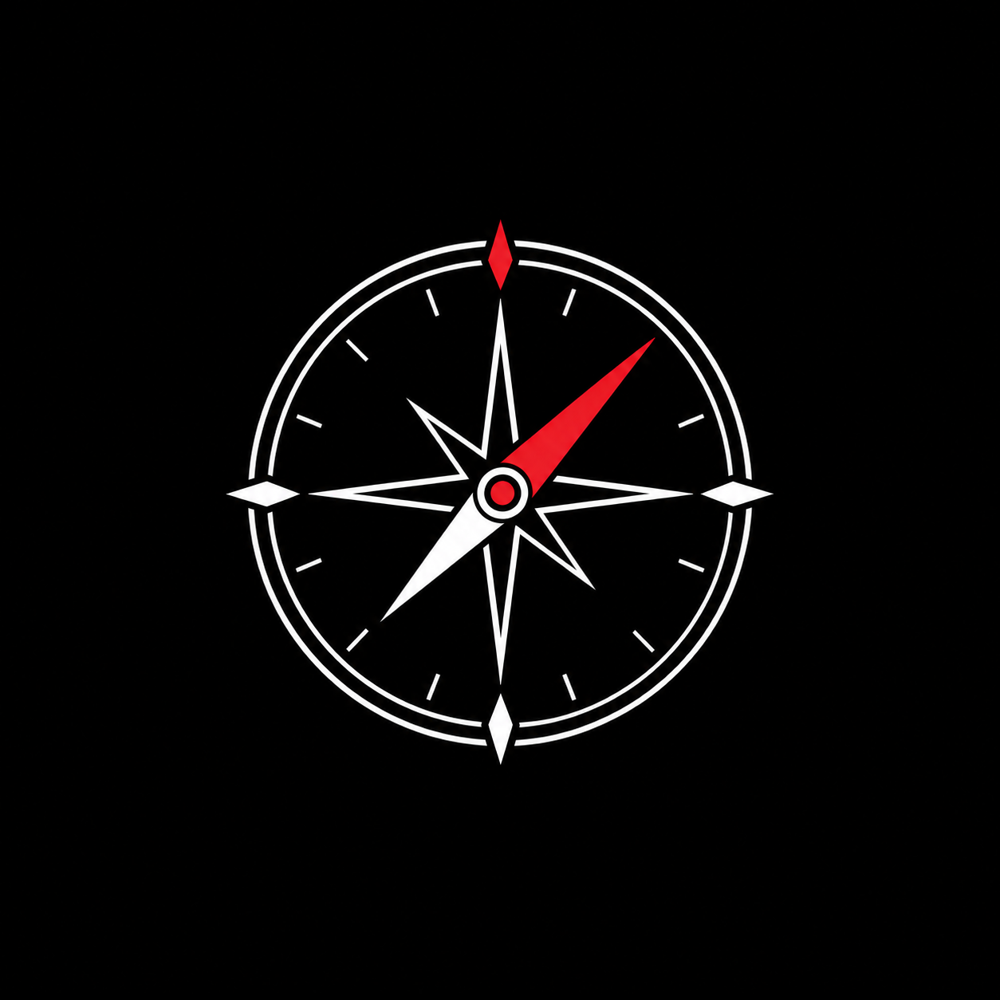

<p align="center">
  
</p>

<h1 align="center">CompassGO</h1>

<p align="center">
  Una aplicación de brújula digital con datos numéricos de ubicación
  y visualización en mapa de la posición del usuario.
</p>

<p align="center">
  
  
  
</p>

---

## Características

- **Brújula digital** en tiempo real usando los sensores del dispositivo
- **Datos de ubicación** con coordenadas precisas (latitud, longitud, altitud)
- **Mapa interactivo** de Google Maps con la posición actual del usuario
- **Skins personalizables** para la brújula
- **Persistencia local** de preferencias del usuario
- **Animaciones fluidas** con Lottie y Animate_do

## Instalación

### Requisitos previos

- Flutter SDK 3.x o superior
- Un proyecto en [Google Cloud](https://console.cloud.google.com/) con **Maps SDK for Android** habilitado

### Pasos

1. **Clonar el repositorio**

```bash
   git clone https://github.com/Leandrop011/compassgo.git
   cd compassgo
```

2. **Instalar dependencias**

```bash
   flutter pub get
```

3. **Configurar variables de entorno**

   Renombrar `.env-example` a `.env` y colocar tu API Key de Google Cloud:

```env
   GOOGLE_MAPS_API_KEY=tu_api_key_aqui
```

4. **Ejecutar la aplicación**

```bash
   flutter run
```

## Dependencias

| Paquete | Uso |
|---|---|
| [`flutter_native_splash`](https://pub.dev/packages/flutter_native_splash) | Splash screen nativo |
| [`flutter_launcher_icons`](https://pub.dev/packages/flutter_launcher_icons) | Ícono de la aplicación |
| [`permission_handler`](https://pub.dev/packages/permission_handler) | Gestión de permisos (requiere cambios en el Manifest) |
| [`flutter_compass`](https://pub.dev/packages/flutter_compass) | Emisión de valores de orientación |
| [`sensors_plus`](https://pub.dev/packages/sensors_plus) | Acceso a los sensores del dispositivo |
| [`google_maps_flutter`](https://pub.dev/packages/google_maps_flutter) | Mapa de Google (requiere proyecto en Google Cloud) |
| [`geolocator`](https://pub.dev/packages/geolocator) | Geolocalización del dispositivo |
| [`shared_preferences`](https://pub.dev/packages/shared_preferences) | Almacenamiento local de datos |
| [`flutter_dotenv`](https://pub.dev/packages/flutter_dotenv) | Variables de entorno (.env) |
| [`lottie`](https://pub.dev/packages/lottie) | Animaciones Lottie |
| [`animate_do`](https://pub.dev/packages/animate_do) | Animaciones de entrada |
| [`uuid`](https://pub.dev/packages/uuid) | Generación de IDs aleatorios |

## Comandos de generación

Splash screen:

```bash
dart run flutter_native_splash:create
```

Ícono de la aplicación:

```bash
dart run flutter_launcher_icons
```

## Notas

- El archivo `.env` no debe subirse al repositorio (ya está incluido en `.gitignore`).
- Los permisos de ubicación deben declararse en `android/app/src/main/AndroidManifest.xml`.